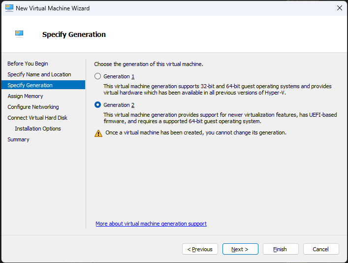
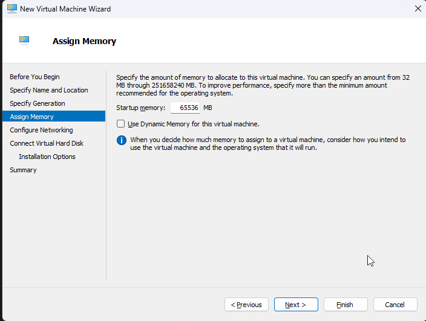
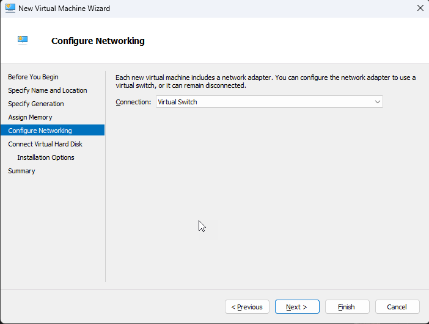
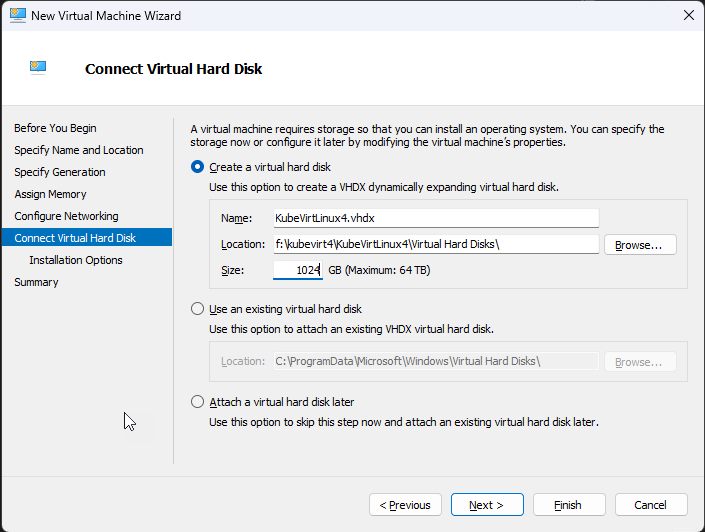
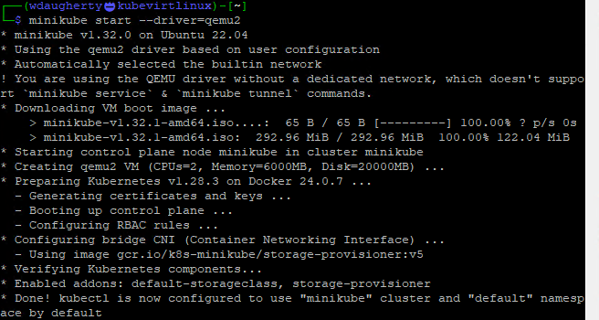
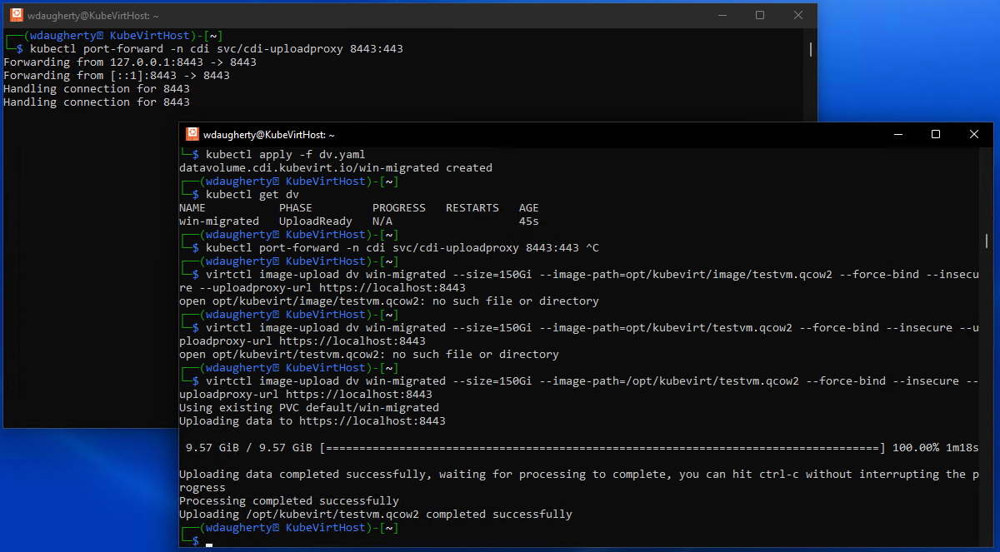
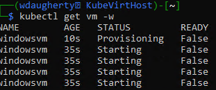

# Migrating a VM from Hyper-V to KubeVirt

## Set up the Hyper-V Guest

1. Create the Hyper-V Machine (RAM, vCPUs, etc.)




NOTE: Do not use Dynamic Memory otherwise we will have problems later.






Note: Install Ubuntu Desktop for this as we will need to use it for VNC later


2. Modify the VM before starting
- Disable Secure Boot


1. Open the Powershell in Administrative Mode

2. Run the following command once you have created it.
```ps
Set-VMProcessor -VMName KubeVirtLinux4 -ExposeVirtualizationExtensions $true
```


NOTE: **KubeVirtLinux4** is the name of my VM


## Start the VM, Install Ubuntu
In this process you will be responsible for installing Ubuntu

## Install SSH Server
```sh
sudo apt update
sudo apt install openssh-server -y
```

## Install Git
```sh
sudo apt install git -y
```

## Install Curl
```sh
sudo apt install curl -y
```

## Install .Bashrc files (optional)
1. For Non Admin user
```sh
cd ~
git clone https://github.com/billsecond/dotfiles.git

cd dotfiles

./install.sh
```
2. For Admin User, first log into that account.
```sh
sudo su
```
3. Now run this, then exit
```sh
cd ~

git clone https://github.com/billsecond/dotfiles.git

cd dotfiles

./install.sh
```

## Install Docker Here

```sh
sudo apt-get update
sudo apt-get install \
     ca-certificates \
     curl \
     gnupg \
     lsb-release

curl -fsSL \
     https://download.docker.com/linux/ubuntu/gpg | \
     sudo gpg --dearmor \
     -o /usr/share/keyrings/docker-archive-keyring.gpg

sudo apt-get update
sudo apt-get remove docker docker-engine docker.io
sudo apt install docker.io

sudo systemctl enable docker
sudo systemctl start docker
sudo systemctl status docker
```

## Install required files for Qemu2
1. Install the QEMU tools
```sh
sudo apt-get install qemu qemu-kvm libvirt-daemon libvirt-clients bridge-utils virt-manager -y
```
2. Add yourself to the user account
```sh
sudo adduser $(whoami) libvirt
```
3. Restart
```sh
sudo reboot
```


## For MiniKube Installs
Perform this in Docker Desktop running Kuberneties or 
[Install Minikube](https://minikube.sigs.k8s.io/docs/start/) in Linux (or *WSL*).

1. Install Minikube
```sh
curl -LO https://storage.googleapis.com/minikube/releases/latest/minikube-linux-amd64
sudo install minikube-linux-amd64 /usr/local/bin/minikube
```

3. Add the dependencies
```sh
sudo apt-get install qemu-kvm libvirt-daemon-system libvirt-clients bridge-utils virt-manager
```
4. Add the Qemu2 Drivers
```sh
sudo apt-get install qemu qemu-kvm libvirt-daemon libvirt-clients bridge-utils virt-manager
```

5. Run the required commands:
```sh
sudo usermod -aG kvm $USER
kvm-ok
sudo apt-get install qemu-kvm libvirt-daemon-system libvirt-clients bridge-utils
sudo modprobe kvm
sudo modprobe kvm-intel
egrep -c '(vmx|svm)' /proc/cpuinfo
sudo reboot
```
NOTE: This will reboot your server.

6. Start Minikube
```sh
minikube start --driver=qemu2 --disk-size 500G
```



## Install KubeVirt
1. Point at latest release
```sh
export RELEASE=$(curl https://storage.googleapis.com/kubevirt-prow/release/kubevirt/kubevirt/stable.txt)
```

2. Deploy the KubeVirt operator
```sh
kubectl apply -f https://github.com/kubevirt/kubevirt/releases/download/${RELEASE}/kubevirt-operator.yaml
```

3. Create the KubeVirt CR (instance deployment request) which triggers the actual installation
```sh
kubectl apply -f https://github.com/kubevirt/kubevirt/releases/download/${RELEASE}/kubevirt-cr.yaml
```

4. Wait until all KubeVirt components are up
```sh
kubectl -n kubevirt wait kv kubevirt --for condition=Available
```


## Prepare the VM
In this example, I have a VM that I am using.  I created a quick small windows server VM running 2019 Standard with Desktop.  We need to copy it from your local host to the VM in a new folder.

1. Create a new folder
```sh
sudo mkdir /opt/kubevirt
```
2. Give permission to the folder (you can adjust for better security)
```sh
 sudo chmod 777 -R /opt/kubevirt/
```


3. Now lets upload the file using FileZilla


## Convert a VM
1. Install qemu-utils
```sh
sudo apt-get install qemu-utils
```

2. Convert the vhdx (shut it down first, making sure it doesn't have any snapshots)
```sh
qemu-img convert -f vhdx -O qcow2 /opt/kubevirt/testvm.vhdx /opt/kubevirt/testvm.qcow2
```

## Install Kubectl
1. Download it
```sh
curl -LO "https://dl.k8s.io/release/$(curl -L -s https://dl.k8s.io/release/stable.txt)/bin/linux/amd64/kubectl"
```
2. Install it
```sh
sudo install -o root -g root -m 0755 kubectl /usr/local/bin/kubectl
```

## Install Virtctl

1. Install virtctl
```sh
export VERSION=v1.1.0
wget https://github.com/kubevirt/kubevirt/releases/download/${VERSION}/virtctl-${VERSION}-linux-amd64
```

2. Move the virtctl file
```sh
sudo mv virtctl-v1.1.0-linux-amd64 /usr/local/bin/virtctl
```

3. Set the file to become an executibile
```sh
sudo chmod +x /usr/local/bin/virtctl
```

## Add a Data Volume
1. Set the latest version
```sh
export VERSION=$(curl -s https://api.github.com/repos/kubevirt/containerized-data-importer/releases/latest | grep '"tag_name":' | sed -E 's/.*"([^"]+)".*/\1/')
```

2. Create the CDI Operator
```sh
kubectl create -f https://github.com/kubevirt/containerized-data-importer/releases/download/$VERSION/cdi-operator.yaml
```

3. Create the CR
```sh
kubectl create -f https://github.com/kubevirt/containerized-data-importer/releases/download/$VERSION/cdi-cr.yaml
```

4. Apply the CR
```sh
kubectl apply -f https://github.com/kubevirt/containerized-data-importer/releases/download/v1.58.0/cdi-cr.yaml
```

5. Set up the DV YAML
```yaml
apiVersion: cdi.kubevirt.io/v1beta1
kind: DataVolume
metadata:
  name: win-migrated # or another name 
spec:
  source:
      upload: {}
  pvc:
    accessModes:
      - ReadWriteOnce
    resources:
      requests:
        storage: 150Gi
```

6. Apply the new DV
```sh
kubectl apply -f dv.yaml
```

7. Check the status of the YAML
```sh
kubectl get dv
```


## Upload the new image

1. Forward the cdi upload proxy to localhost (in another terminal)
```sh
kubectl port-forward -n cdi svc/cdi-uploadproxy 8443:443 
```

2. In the original terminal, upload the new disk
```sh
virtctl image-upload dv win-migrated --size=150Gi --image-path=/opt/kubevirt/testvm.qcow2 --force-bind --insecure --uploadproxy-url https://localhost:8443
```



8. Terminate the web service port foward


## Creating the VM
1. Create a new vm.yaml file with the following content.

```yaml
apiVersion: kubevirt.io/v1
kind: VirtualMachine
metadata:
  labels:
    app: windowsvm
  name: windowsvm
spec:
  dataVolumeTemplates:
    - apiVersion: cdi.kubevirt.io/v1beta1
      kind: DataVolume
      metadata:
        name: windowsvm
        annotations:
          cdi.kubevirt.io/storage.bind.immediate.requested: ''
          cdi.kubevirt.io/storage.usePopulator: 'true'
      spec:
        source:
          pvc:
            name: win-migrated
        storage:
          accessModes:
            - ReadWriteOnce
          resources:
            requests:
              storage: 150Gi
  running: true
  template:
    metadata:
      annotations:
        vm.kubevirt.io/os: windows11
        vm.kubevirt.io/workload: desktop
      labels:
        kubevirt.io/domain: windowsvm
    spec:
      networks:
        - name: default
          pod: {}
      volumes:
        - name: rootdisk
          dataVolume:
            name: windowsvm
        - name: windows-drivers-disk
          containerDisk:
            image: docker.io/kubevirt/virtio-container-disk
      domain:
        devices:
          disks:
            - name: rootdisk
              bootOrder: 1
              disk:
                bus: sata
            - name: windows-drivers-disk
              cdrom:
                bus: sata
          inputs:
            - bus: usb
              name: tablet
              type: tablet
          interfaces:
            - name: default
              masquerade: {}
              model: e1000e
          tpm: {}
        cpu:
          cores: 2
          sockets: 1
          threads: 1
        memory:
          guest: 2Gi
        machine:
          type: pc-q35-rhel9.2.0
        firmware:
          bootloader:
            efi:
              secureBoot: false
        clock:
          timer:
            hpet:
              present: false
            hyperv: {}
            pit:
              tickPolicy: delay
            rtc:
              tickPolicy: catchup
          utc: {}
        features:
          acpi: {}
          apic: {}
          hyperv:
            frequencies: {}
            ipi: {}
            reenlightenment: {}
            relaxed: {}
            reset: {}
            runtime: {}
            spinlocks:
              spinlocks: 8191
            synic: {}
            synictimer:
              direct: {}
            tlbflush: {}
            vapic: {}
            vpindex: {}
          smm: {}
        resources: {}
      terminationGracePeriodSeconds: 3600
      architecture: amd64
```

2. Build the VM
```sh
kubectl apply -f vm.yaml
```

3. Check the status of the VM using the wait operator
```sh
# Use the '-w' to wait and to continue to show the status
kubectl get vm -w
```


4. Access VM via VNC
```sh
virtctl vnc windowsvm
```


## Notes
Below are some other commands that I have been using that prove to be helpful.

#### Gets all of the VMs
```sh
kubectl get vms 
```

#### Gets a bit more detail about the specific VM (windowsvm)
```sh
kubectl get vm windowsvm
```

#### Describes with good detail the speicifc VM (windowsvm)
```sh
kubectl describe vm windowsvm
```

#### Gets all PVCs
```sh
kubectl get pvc
```

#### Describes the specific DV
```sh
kubectl describe dv
```

#### Gets all of the pods
```sh
kubectl get pods
```

#### Get the logs of the specific VM
```sh
kubectl logs virt-launcher-windowsvm-6sgft
```

#### Gets all of the pods
```sh
kubectl logs $(kubectl get pods -o name)
```

#### Starts the Windows VM
```sh
virtctl start windowsvm
```